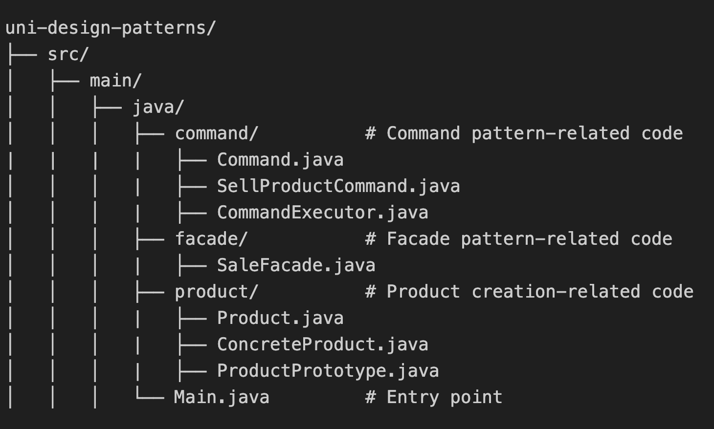

# Project Overview

This project implements a Java console program designed as a supermarket management system. The main functionality includes inventory management and product sales.

## File Structure

# Part 1: Inventory Management

This functionality manages product creation and inventory updates, using the following design patterns:

## Applied Design Patterns

### Factory Method (Creational)
The Factory Method pattern is used to encapsulate the creation logic for different types of products (e.g., fruits, vegetables, beverages). This promotes code reusability and flexibility, as new product types can be added without altering existing code. By relying on a factory, the system maintains a single responsibility for product creation, adhering to the Open/Closed Principle.

### Decorator (Structural)
The Decorator pattern allows dynamic addition of features to products, such as marking them as imported or discounted. This eliminates the need for rigid class hierarchies to represent combinations of features, providing greater flexibility and scalability.

### Observer (Behavioral)
The Observer pattern facilitates the notification mechanism when inventory changes occur, such as when new products are added. This ensures separation of concerns, as inventory management and notification logic are decoupled, making the system easier to maintain and extend.

## Implementation

### Product and Factory (Creation)

- src/main/java/product/Product.java   Defines the abstract product class.

- src/main/java/product/Fruit.java   Implements a concrete product class (Fruit).

- src/main/java/product/ProductFactory.java   Defines the abstract factory class.

- src/main/java/product/FruitFactory.java   Implements a concrete factory for creating fruits.

### Decorator (Dynamic Features)

- src/main/java/product/ProductDecorator.java   Defines the abstract product decorator.

- src/main/java/product/ImportedProduct.java   Implements a decorator for imported products.

- src/main/java/product/DiscountedProduct.java   Implements a decorator for discounted products.

### Observer (Inventory Notifications)

- src/main/java/observer/Observer.java   Defines the observer interface.

- src/main/java/observer/Admin.java   Implements the administrator observer.

- src/main/java/inventory/Inventory.java   Implements the inventory management system.

# Part 2: Product Sales and Shipping

This functionality enables product sales and logistics management, using the following design patterns:

## Applied Design Patterns

### Prototype (Creational)
The Prototype pattern is used to clone existing product instances to quickly generate multiple identical products. This is particularly useful in scenarios where the cost of creating a product from scratch is high or where identical instances need to share the same base configuration.

### Facade (Structural)
The Facade pattern simplifies the complex process of product sales by providing a unified interface to manage order creation, invoice generation, and logistics. This abstraction hides the intricacies of the underlying subsystems, making the system easier to use and reducing dependencies between components.

### Command (Behavioral)
The Command pattern encapsulates the logic for selling products into individual command objects. This allows for batch processing, undo functionality, and flexible execution of commands. It also promotes separation of concerns by decoupling the client code from the logic of the operations.

## Implementation

### Prototype (Cloning Products)

- src/main/java/product/ProductPrototype.java   Defines the prototype interface.

- src/main/java/product/ConcreteProduct.java   Implements the product cloning functionality.

### Facade (Simplified Sales Process)

- src/main/java/facade/SaleFacade.java   Encapsulates the main steps of the sales process, such as order creation, printing the invoice, and arranging logistics.

### Command (Encapsulating Operations)

- src/main/java/command/Command.java   Defines a unified interface for commands.

- src/main/java/command/SellProductCommand.java   Implements the command for selling products.

- src/main/java/command/CommandExecutor.java   Manages and executes multiple commands for batch sales.

### Main Program Entry

- src/main/java/Main.java   Integrates all components to demonstrate inventory functionality.

# Team Members
- Luyue Zhang: Part 1
- Anan Li: Part 2

